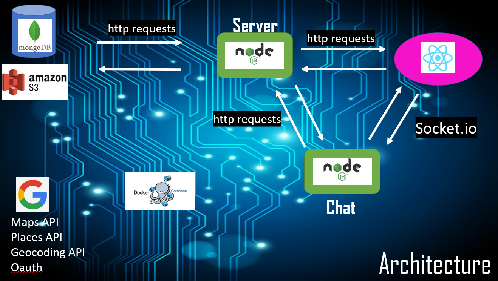

# Hommies - Apartments Renting App 🏠

Hommies is an end-to-end platform for finding the right apartment for the user looking for one, and help the landlord rent out his flat.

**The app has 2 client side:**

- User who searches for an apartment.
- User (owner) who has an apartment and wants to rent out it.

**Both client sides:**

- sign in / up: each new user can sign up by filling personal details and choose his purpose of usage
  (signing can be performed by google acount as well).

  

- Chat: If an owner approved certain user, a chat room will be opened the both sides can communicate in their.
  In addition, files can be sent as well through the chat for exchanging additional pictures or to send a contract for example.

  

**Searching User:**

- The searching user can fill in his preferences (address, price, number of rooms, size, ect...).
- Then, each time, one flat will appear with its details and location on a map.
- The user can click "Like" or "Dislike" - if he liked, the owner will see that user in the list of likes for the specific apartment.
- The user also can see history of liked apartments.
- The user can chat if the owners who approved him.

**Owner:**

- The owner has the option to upload a new apartment to the platform by filling its details.
- The owner home page is a list of all his assets.
- Each apartment contains list of user who liked that apartment with basic information about them:
  name, email, age, phone number and a profile picture.
- The owner has the ability to approve a user.

- After the approval, a chat room will be opened for them in order to chat and close a contract.

**Technologies:**

    - Docker:
        There are 4 services running together in a docker-compose:
        - client
        - main server
        - chat server (socket.io)
        - mongodb

    - Client: built by `React` and `redux-toolkit`.
    - Main server: built by `Node.js` and `express`.
    - Chat server: built by `Node.js`, `express` and `socket.io` for the live chat.
    - Database: `Mongodb` in a `docker container`

    - All picturse (profile pictures and apartments pictures) were saved in `AWS S3 bucket`.
    - Places search bar and Maps were created using `Google Apis`: places, geocoding and maps.

